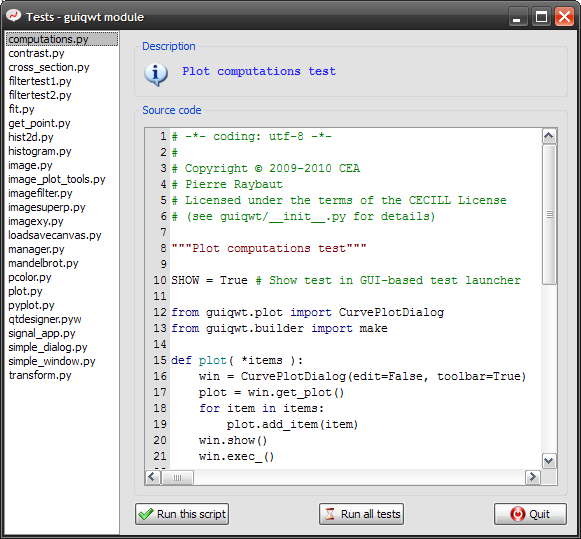
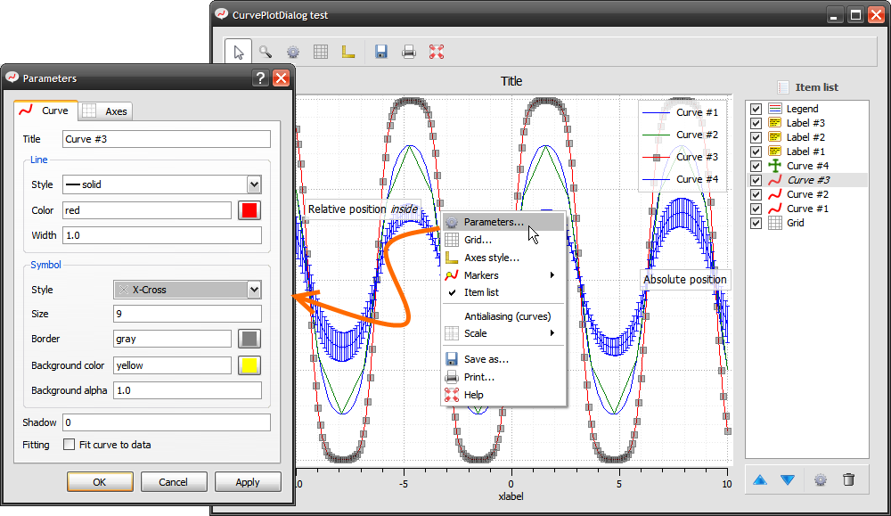
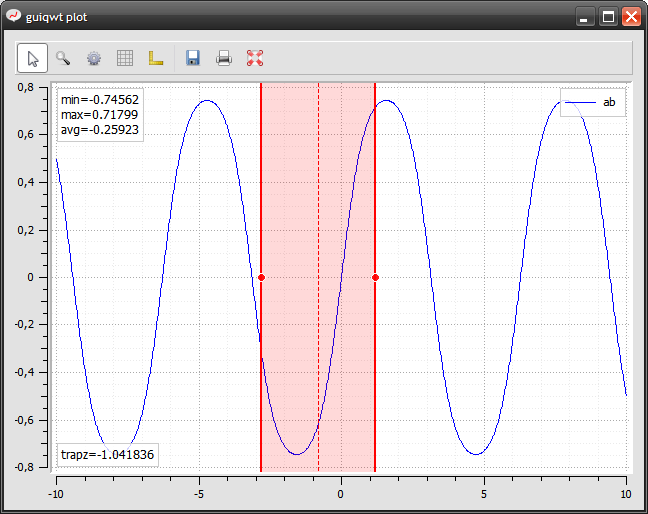
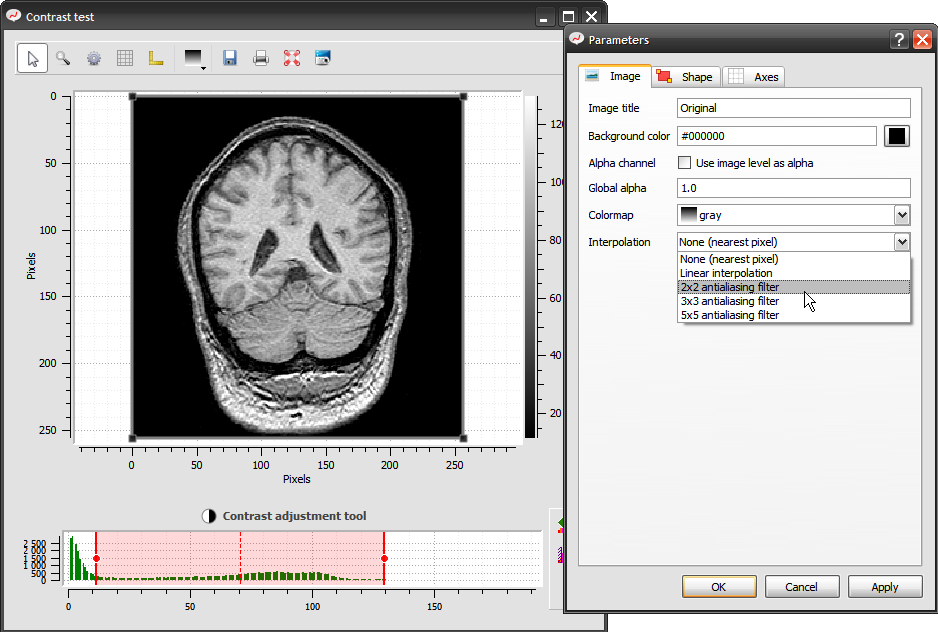
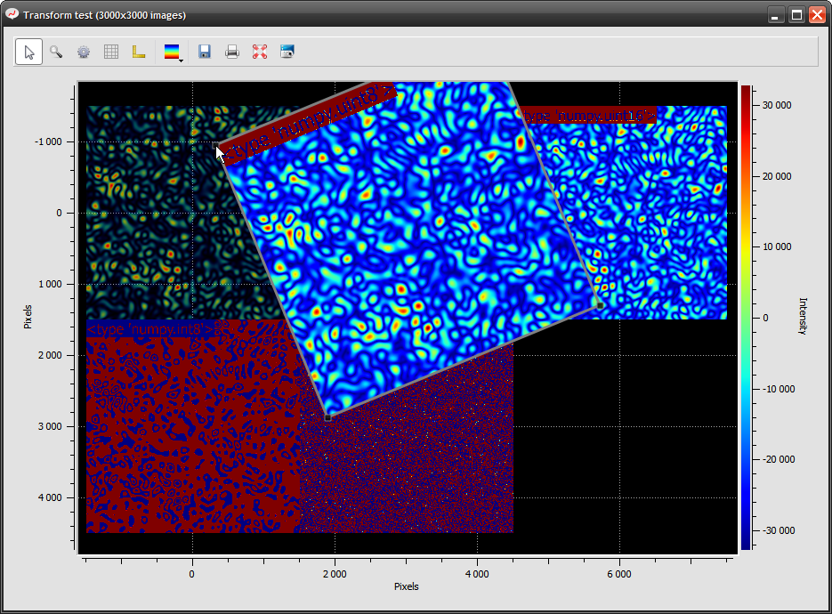
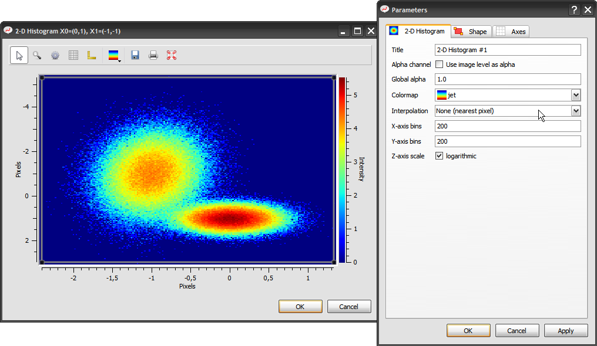
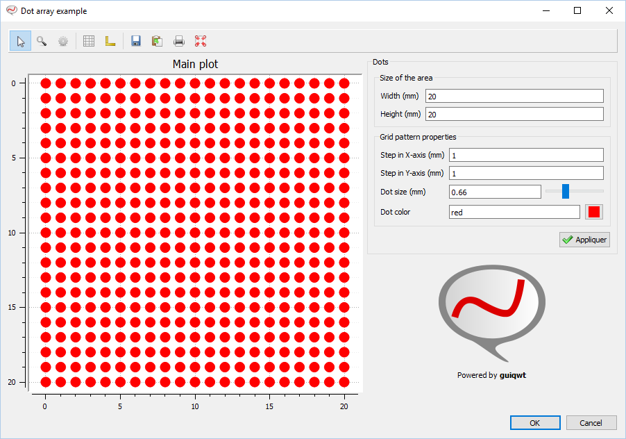
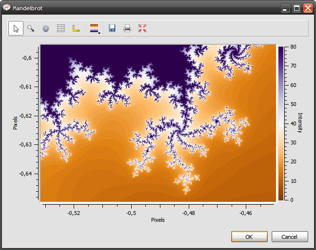
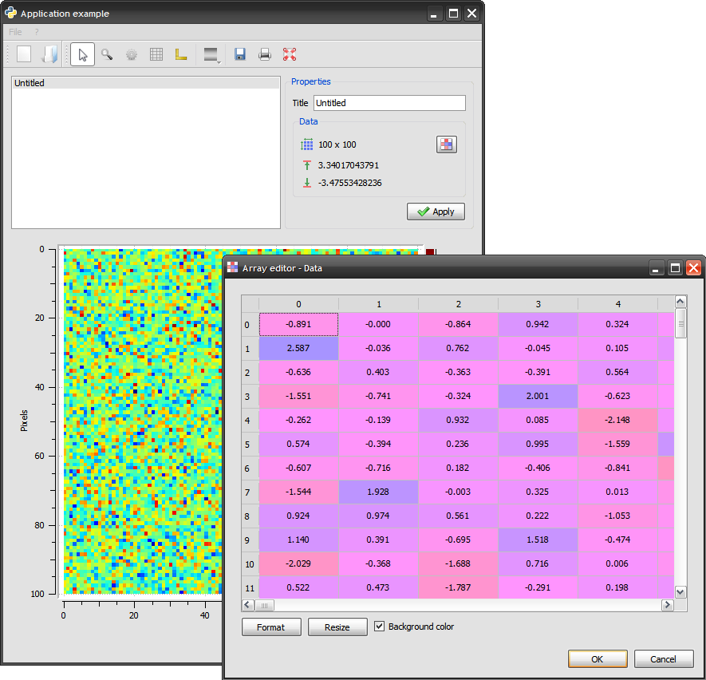

.. _examples:

Examples
========

The test launcher
-----------------

A lot of examples are available in the `guiqwt` test module ::

    from guiqwt import tests
    tests.run()

The two lines above execute the `guiqwt test launcher`:

Curve plotting
--------------

Basic curve plotting
~~~~~~~~~~~~~~~~~~~~

.. literalinclude:: ../guiqwt/tests/plot.py
   :start-after: SHOW
   :end-before: Workaround for Sphinx v0.6 bug: empty 'end-before' directive

Computations on curves
~~~~~~~~~~~~~~~~~~~~~~

.. literalinclude:: ../guiqwt/tests/computations.py
   :start-after: SHOW
   :end-before: Workaround for Sphinx v0.6 bug: empty 'end-before' directive

Curve fitting
-------------

.. literalinclude:: ../guiqwt/tests/fit.py
   :start-after: SHOW
   :end-before: Workaround for Sphinx v0.6 bug: empty 'end-before' directive

.. image:: images/screenshots/fit.png

Image visualization
-------------------

Image contrast adjustment
~~~~~~~~~~~~~~~~~~~~~~~~~

.. literalinclude:: ../guiqwt/tests/contrast.py
   :start-after: SHOW
   :end-before: Workaround for Sphinx v0.6 bug: empty 'end-before' directive

Image cross-sections
~~~~~~~~~~~~~~~~~~~~

.. literalinclude:: ../guiqwt/tests/cross_section.py
   :start-after: SHOW
   :end-before: Workaround for Sphinx v0.6 bug: empty 'end-before' directive

.. image:: images/screenshots/cross_section.png

Transformable images
~~~~~~~~~~~~~~~~~~~~

Affine transforms example on 3000x3000 images (real-time transforms):

.. literalinclude:: ../guiqwt/tests/transform.py
   :start-after: SHOW
   :end-before: Workaround for Sphinx v0.6 bug: empty 'end-before' directive

Image rectangular filter
~~~~~~~~~~~~~~~~~~~~~~~~

.. literalinclude:: ../guiqwt/tests/imagefilter.py
   :start-after: SHOW
   :end-before: Workaround for Sphinx v0.6 bug: empty 'end-before' directive

.. image:: images/screenshots/imagefilter.png

Histograms
----------

2-D histogram
~~~~~~~~~~~~~

.. literalinclude:: ../guiqwt/tests/hist2d.py
   :start-after: SHOW
   :end-before: Workaround for Sphinx v0.6 bug: empty 'end-before' directive

Other examples
--------------

Dot Array Demo
~~~~~~~~~~~~~~

.. literalinclude:: ../guiqwt/tests/dotarraydemo.py
   :start-after: SHOW
   :end-before: Workaround for Sphinx v0.6 bug: empty 'end-before' directive

Image plot tools
~~~~~~~~~~~~~~~~

.. literalinclude:: ../guiqwt/tests/image_plot_tools.py
   :start-after: SHOW
   :end-before: Workaround for Sphinx v0.6 bug: empty 'end-before' directive

.. image:: images/screenshots/image_plot_tools.png

Real-time Mandelbrot plotting
~~~~~~~~~~~~~~~~~~~~~~~~~~~~~

.. literalinclude:: ../guiqwt/tests/mandelbrot.py
   :start-after: SHOW
   :end-before: Workaround for Sphinx v0.6 bug: empty 'end-before' directive

Simple application
~~~~~~~~~~~~~~~~~~

.. literalinclude:: ../guiqwt/tests/simple_window.py
   :start-after: SHOW
   :end-before: Workaround for Sphinx v0.6 bug: empty 'end-before' directive

