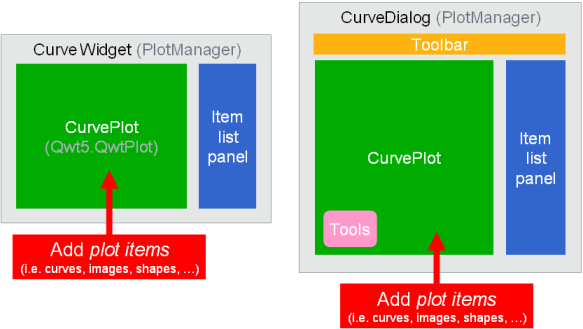
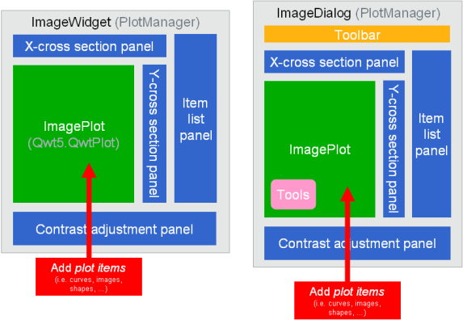

Overview
========

Based on `PythonQwt` (plotting widgets for Python-Qt graphical user 
interfaces) and on the scientific modules `NumPy` and `SciPy`, `guiqwt` is a 
Python library providing efficient 2D data-plotting features (curve/image 
visualization and related tools) for interactive computing and signal/image 
processing application development.

Performances
~~~~~~~~~~~~

The most popular Python module for data plotting is currently `matplotlib`, 
an open-source library providing a lot of plot types and an API (the `pylab`
interface) which is very close to MATLAB's plotting interface.

`guiqwt` plotting features are quite limited in terms of plot types compared 
to `matplotlib`. However the currently implemented plot types are much more 
efficient.
For example, the `guiqwt` image showing function (:py:func:`guiqwt.pyplot.imshow`) 
do not make any copy of the displayed data, hence allowing to show images which 
are much larger than with its `matplotlib`'s counterpart. In other terms, when 
showing a 30-MB image (16-bits unsigned integers for example) with `guiqwt`, 
no additional memory is wasted to display the image (except for the offscreen 
image of course which depends on the window size) whereas `matplotlib` takes 
more than 600-MB of additional memory (the original array is duplicated four 
times using 64-bits float data types).

Features
~~~~~~~~

The `guiqwt` library also provides the following features:

    * :py:mod:`guiqwt.pyplot`: equivalent to :py:mod:`matplotlib.pyplot`, at 
      least for the implemented functions

    * supported `plot items`:

        - :py:mod:`guiqwt.curve`: curves and error bar curves
        - :py:mod:`guiqwt.histogram`: 1D histograms
        - :py:mod:`guiqwt.image`: images (RGB images are not supported), 
          images with non-linear x/y scales, images with specified pixel size 
          (e.g. loaded from DICOM files), 2D histograms, pseudo-color images 
          (`pcolor`)
        - :py:mod:`guiqwt.label`: labels, curve plot legends
        - :py:mod:`guiqwt.shapes`: polygon, polylines, rectangle, circle, 
          ellipse and segment
        - :py:mod:`guiqwt.annotations`: annotated shapes (shapes with labels 
          showing position and dimensions): rectangle with center position and 
          size, circle with center position and diameter, ellipse with center 
          position and diameters (these items are very useful to measure things 
          directly on displayed images)

    * curves, images and shapes:

        * multiple object selection for moving objects or editing their 
          properties through automatically generated dialog boxes (``guidata``)
        * item list panel: move objects from foreground to background, 
          show/hide objects, remove objects, ...
        * customizable aspect ratio
        * a lot of ready-to-use tools: plot canvas export to image file, image 
          snapshot, image rectangular filter, etc.

    * curves:

        * interval selection tools with labels showing results of computing on 
          selected area
        * curve fitting tool with automatic fit, manual fit with sliders, ...

    * images:

        * contrast adjustment panel: select the LUT by moving a range selection 
          object on the image levels histogram, eliminate outliers, ...
        * X-axis and Y-axis cross-sections: support for multiple images,
          average cross-section tool on a rectangular area, ...
        * apply any affine transform to displayed images in real-time (rotation,
          magnification, translation, horizontal/vertical flip, ...)

    * application development helpers:

        * ready-to-use curve and image plot widgets and dialog boxes
          (see :py:mod:`guiqwt.plot`)
        * load/save graphical objects (curves, images, shapes)
        * a lot of test scripts which demonstrate `guiqwt` features 
          (see :ref:`examples`)

How it works
~~~~~~~~~~~~

A `guiqwt`-based plotting widget may be constructed using one of the following 
methods:

    * *Interactive mode*: when manipulating and visualizing data in an interactive
      Python or IPython interpreter, the :py:mod`guiqwt.pyplot` module provide 
      the easiest way to plot curves, show images and more. Syntax is similar 
      to MATLAB's, thus very easy to learn and to use interactively.

    * *Script mode*: when manipulating and visualizing data using a script, the 
      :py:mod`guiqwt.pyplot` module is still a good choice as long as you don't 
      need to customize the figure graphical user interface (GUI) layout. 
      However, if you want to add other widgets to the GUI, like menus, buttons 
      and so on, you should rather use plotting widget classes instead of 
      the `pyplot` helper functions.

There are two kinds of plotting widgets defined in `guiqwt`:

    * low-level plotting widgets: :py:class:`guiqwt.curve.CurvePlot` and 
      :py:class:`guiqwt.image.ImagePlot`

    * high-level plotting widgets (ready-to-use widgets with integrated tools 
      and panels): :py:class:`guiqwt.plot.CurveWidget` and 
      :py:class:`guiqwt.plot.ImageWidget`, and corresponding dialog boxes 
      :py:class:`guiqwt.plot.CurveDialog` and 
      :py:class:`guiqwt.plot.ImageDialog`

Curve-related widgets with integrated plot manager:

Image-related widgets with integrated plot manager:

.. seealso::
    
    Module :py:mod:`guiqwt.curve`
        Module providing curve-related plot items and plotting widgets
        
    Module :py:mod:`guiqwt.image`
        Module providing image-related plot items and plotting widgets
        
    Module :py:mod:`guiqwt.plot`
        Module providing ready-to-use curve and image plotting widgets and 
        dialog boxes
