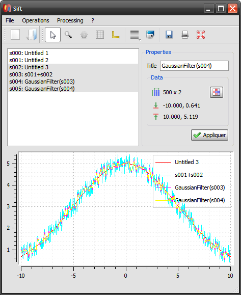

Sift, the Signal and Image Filtering Tool
=========================================

`Sift` is a simple signal and image processing application based on ``guiqwt`` 
and ``guidata``.

Even if it could be extended with powerful features like its closed-source 
counterpart, `Sift` is quite limited in its current implementation. For now, 
its main purpose is only to demonstrate some of the application development 
features provided by ``guidata`` and ``guiqwt``.

.. literalinclude:: ../guiqwt/sift.pyw
   :start-after: SHOW
   :end-before: Workaround for Sphinx v0.6 bug: empty 'end-before' directive
