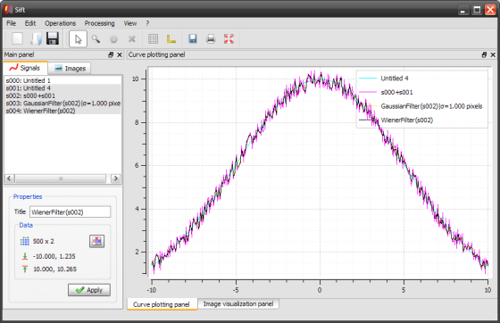
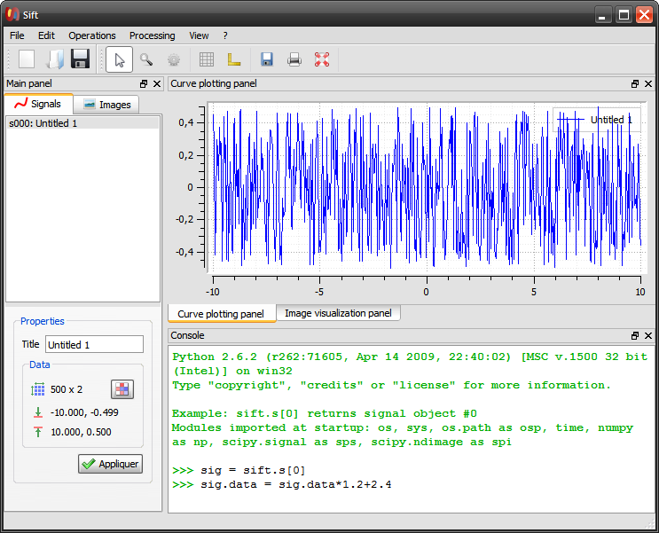
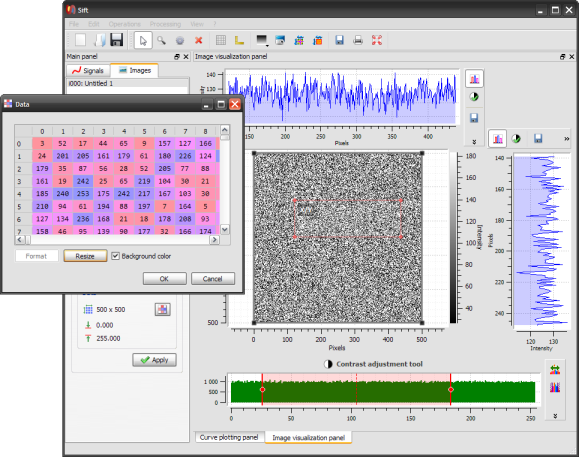

Sift, the Signal and Image Filtering Tool
=========================================

`Sift` is a simple signal and image processing application based on ``guiqwt`` 
and ``guidata``.

Note that `Sift` includes an embedded Python console to manipulate directly 
the signal and image objects (see screenshot below) -- this feature requires 
``spyderlib`` (successfully tested with `Spyder` v2.0.10 and v2.1.0dev).

Even if it could be extended with powerful features like its closed-source 
counterpart, `Sift` is quite limited in its current implementation. For now, 
its main purpose is to show how to create easily and rapidly your own 
signal/image processing application using ``guidata`` and ``guiqwt``.

.. literalinclude:: ../guiqwt/tests/sift.py
   :start-after: SHOW
   :end-before: Workaround for Sphinx v0.6 bug: empty 'end-before' directive
