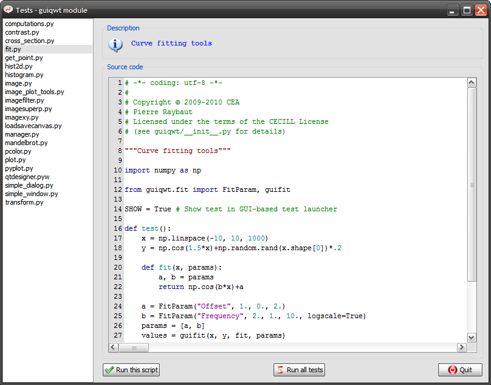
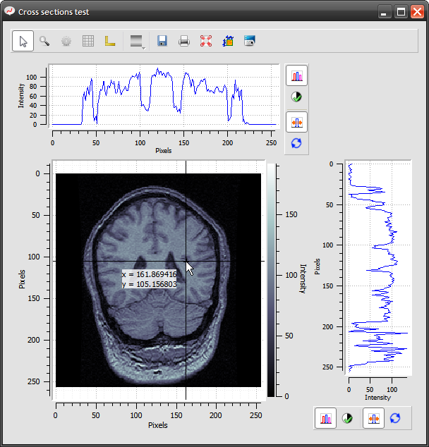
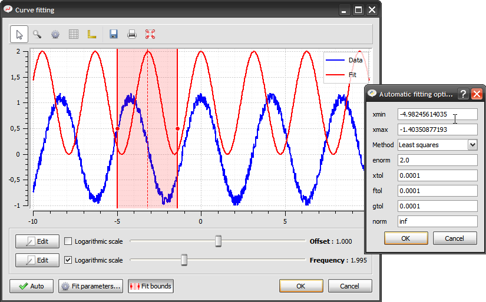
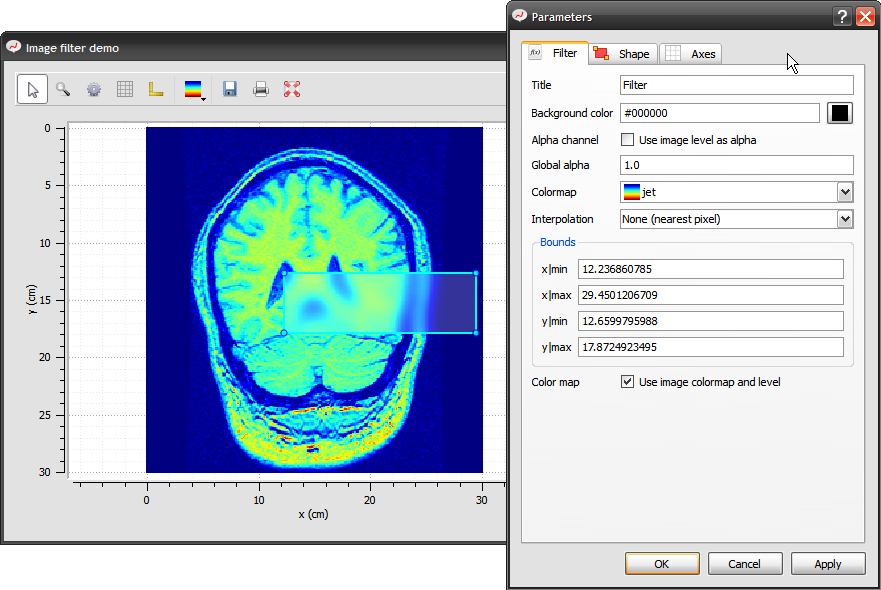

Examples
========

A lot of examples are available in the `guiqwt` test module ::

 from guiqwt import tests
 tests.run()

The two lines above execute the `guiqwt` *test launcher*:

Curve plotting example:

.. image:: images/screenshots/plot.png

Image contrast adjustment example:

.. image:: images/screenshots/contrast.png

Image cross-sections example:

2-D histogram example:

.. image:: images/screenshots/hist2d.png

Affine transforms example on 3000x3000 images (real-time transforms):

.. image:: images/screenshots/transform.png

Computations on curves:

.. image:: images/screenshots/computations.png

Curve fitting tool:

Image plot tools:

.. image:: images/screenshots/image_plot_tools.png

Real-time Mandelbrot plotting:

.. image:: images/screenshots/mandelbrot.png

Image rectangular filter example:

Simple application example:

.. image:: images/screenshots/simple_window.png
